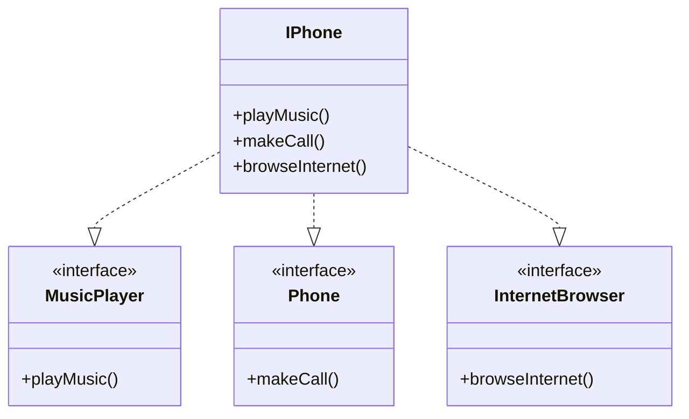

# Modelo: IML

## COMO BASE: [Lançamento iPhone 2017](https://www.youtube.com/watch?v=9ou608QQRq8)

### Funcionalidades a Modelar
1. Reprodutor Musical
- Métodos: tocar(), pausar(), selecionarMusica(String musica)
2. Aparelho Telefônico
- Métodos: ligar(String numero), atender(), iniciarCorreioVoz()
3. Navegador na Internet
- Métodos: exibirPagina(String url), adicionarNovaAba(), atualizarPagina()
  
**Objetivo**

1. Criar um diagrama UML que represente as funcionalidades descritas acima.
2. Implementar as classes e interfaces correspondentes em Java (Opcional).
   
> Colocando em prática toda a concepção de análise de negócios, requisitos, conceitos da programação orientada a objetos e modelagem UML. 

